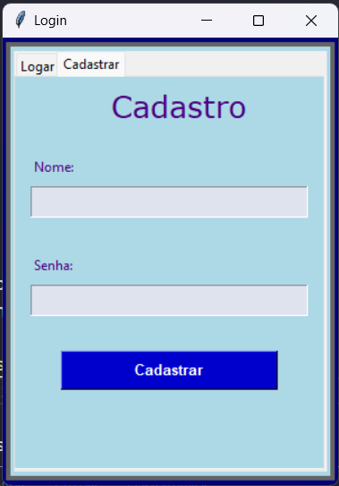
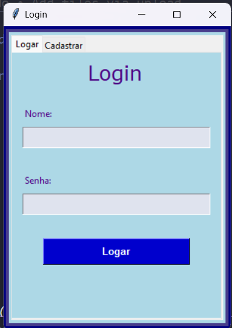
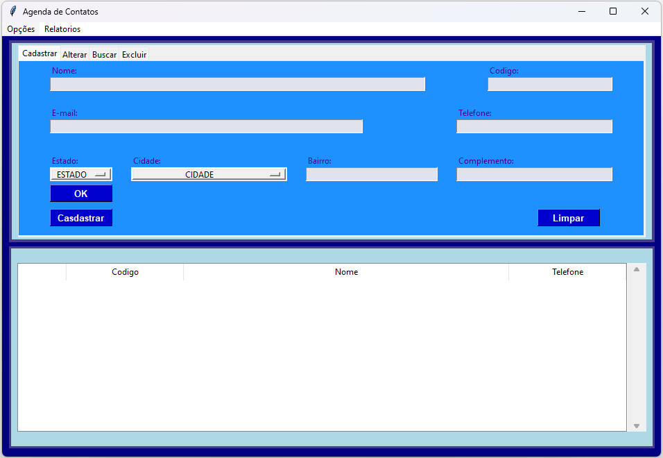
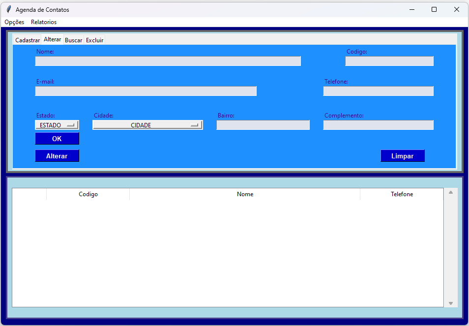
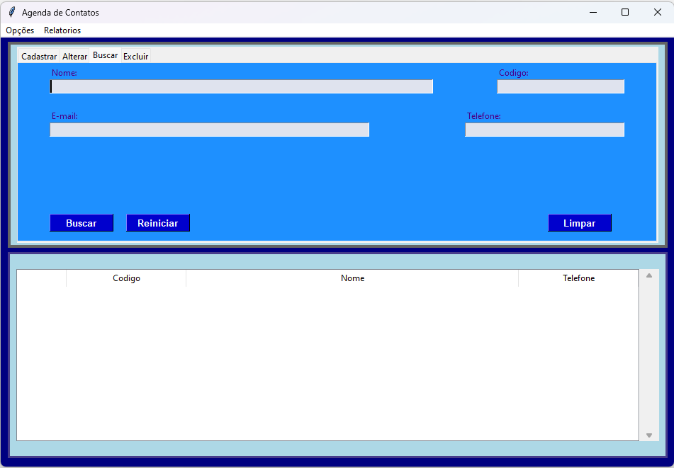
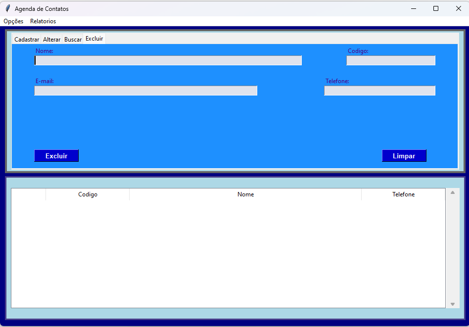
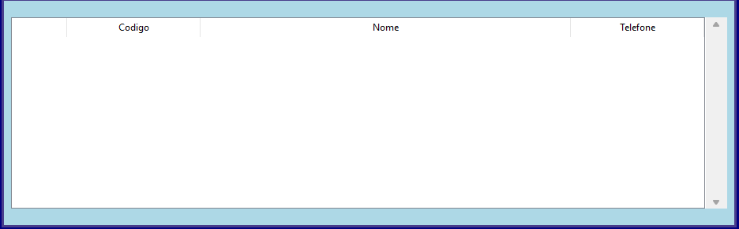

# Agenda

## Project Description

This project was made completely in python with the tkinter library. 

The project basically consists of something similar to a phone book, that with each new user regitered a new datebase is created to save your contacts together with a treeview (for improve the designer)

<!--⚠️ ATENÇÃO - Projeto em processo de atualização-->

## Previous settings

For run this project you need to be with the python installed in your computer.

## Project explication

### Login window: 

#### "Cadastrar" Tab:

  

+ Fields of filling:
  + "Nome";
  + "Senha";
+ Buttons:
  + "Cadastrar"
    + It made the new user registration in datebase;
    + Reset the fields;

#### "Logar" Tab:

  

+ After of the new user registration
+ Fields of filling:
  + "Nome"
  + "Senha"
+ Buttons:
  + "Logar"
    + The program search (in the datebase) the user and confirm password;
    + Correct password: 
      + Warning prompt: "Login feito com sucesso";
      + It's created a datebase with user name registered. For to save the registers made by that user;
    + Incorrect password: 
      + Warning prompt: "Cadastro não existe";
      + Reset fields;

### Main Window

#### "Cadastrar" tab:

  

+ Fields of filling:
  + "Nome" - mandatory filling
  + "Código" (For it improves identification) - mandatory filling
  + "E-mail"
  + "Telefone"
  + "Estado" (options main)
  + "Cidade" (options main that depend on the Estado)
  + "Bairro"
  + "Complemento"
+ Buttons
  + "OK"
    + It fill the field "Cidade" it according to the state chosen by the user
  + "Cadastrar"
    + It save to datebase and it show in the table below it the new register (Note: The "código" have that to be exclusivity for the new registrant)
  + "Limpar"
    + it clean all the fields on the "Cadastrar" tab. 

#### "Alterar" tab

  

For use of this tab, you must to choose a registation already made in table that which is below and double click for automatically fill all fields with the data chosen register, that you want to change.

+ Fields of filling:
  + "Nome" - mandatory filling
  + "Código" (For it improves identification) - mandatory filling
  + "E-mail"
  + "Telefone"
  + "Estado" (options main)
  + "Cidade" (options main that depend on the Estado)
  + "Bairro"
  + "Complemento"
+ Buttons
  + "OK"
    + It fill the field "Cidade" it according to the state chosen by the user
  + "Alterar"
    + It saves the changes that you made in the chosen register inside the datebase (Note: The "código" have that to be xclusive of this register)
  + "Limpar"
    + It clean all the fields in the "Alterar" tab 

#### "Buscar" tab

  

+ Fields of filling:
  + "Nome" - mandatory filling
  + "Código" (For it improves identification) - mandatory filling
  + "E-mail"
  + "Telefone"
+ Buttons
  + "Reiniciar"
    + It resets the table below, after a searchServer para reiniciar a tabela abaixo apos uma busca
  + "Buscar"
    + It searches the datebase for registters that have the informations provided by the user and it show in the tableServe para buscar no banco de dados os cadastros que tem as informações preenchidas pelo usuário e mostra na tabela abaixo
  + "Limpar"
    + It clean all the fields in the "Alterar" tab

#### "Excluir" tab

  

+ Fields of filling:
  + "Nome" - mandatory filling
  + "Código" (For it improves identification) - mandatory filling
  + "E-mail"
  + "Telefone"
+ Buttons
  + "Excluir"
    + it searches the basedate for resgitters that have the informations provided by the user and if the field "codigo" is filled in, the register will be deleted from the datebase
  + "Limpar"
    + it clean all the fields in the "Excluir" tab

#### Tabela

  

It get all register, sort the names alphabetically and it show all the regitters in the table (only "Nome", "Código" and "Telefone")
